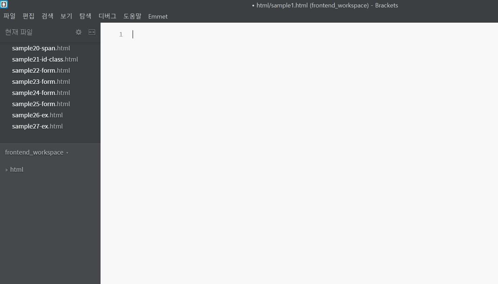
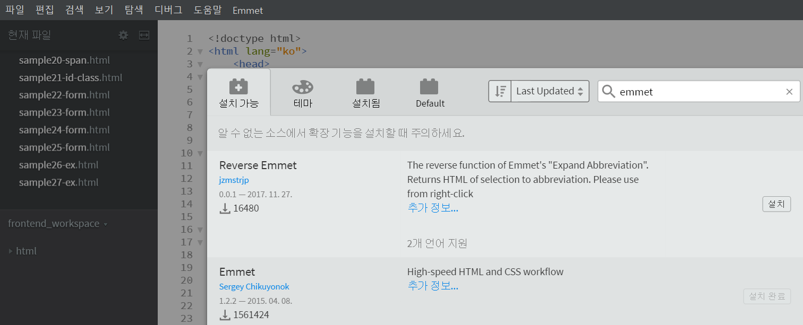

```
* 3년전 메모용으로 기록해두었던 HTML 공부내용을 포스팅 겸, 복습 차원에서 포스팅하겠습니다.
```

# Brackets

## 1. Install

[설치 링크](http://brackets.io/)

설치법은 간단합니다. 직관적으로 프로그램 설치하듯이 설치를 해주시면 되겠습니다.

<br/>

설치가 완료된 후, 실행하시면 다음과 같은 기본화면이 나옵니다. <br/>
<span style="color:red">(처음에 파일들이 저장될 저장디렉토리를 지정해주시기 바랍니다.)</span>



## 2. Setting

HTML코딩에 앞서서, 설정을 하겠습니다.

좌측 상단에 파일- 확장 기능 관리자를 클릭하시면, 이클립스에서 마켓과 비슷한 곳을 들어갈 수 있습니다.

검색란에 <strong>'emmet'</strong>을 검색하여 설치해주시기 바랍니다.

```js
* emmet : html 개발툴에서 zen-coding(자동완성)을 도와주는 플러그인입니다.
(atom, notepad++, brackets 등에서 사용가능합니다.)
```



## Fin.

이 정도면, HTML의 기본적인 코딩을 위해서 준비가 어느 정도 끝나게 됩니다.

다음 포스팅에서부터 HTML의 기초에 대해서 다뤄보도록 하겠습니다.
