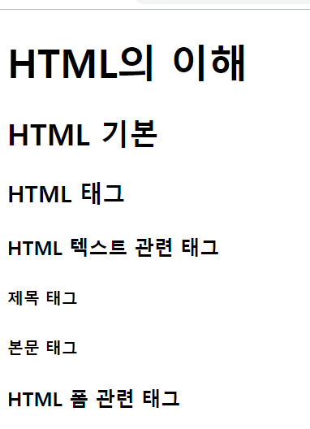

## <h#> 태그

- `<h1>, <h2>, <h3>, <h4>, <h5>, <h6> 태그.`

- 헤드역할을 하는 글자를 크기별로(h1~h6) 나눠주는 태그이다.

```html
<!DOCTYPE html>
<html lang="kor">
  <head>
    <meta charset="UTF-8" />
    <title>Document</title>
  </head>
  <body>
    <!--
            <h1> ~ <h6>
            문서의 제목을 포함하는 태그
        -->
    <h1>HTML의 이해</h1>
    <h2>HTML 기본</h2>
    <h3>HTML 태그</h3>

    <h4>HTML 텍스트 관련 태그</h4>
    <h5>제목 태그</h5>
    <h5>본문 태그</h5>

    <h4>HTML 폼 관련 태그</h4>
  </body>
</html>
```



## `<p>태그, <br>태그, <hr>태그, <blockquote>태그`

<br/>

```html
<!DOCTYPE html>
<html lang="ko">
  <head>
    <meta charset="UTF-8" />
    <title>Document</title>
  </head>
  <body>
    <h1>html 태그 연습</h1>
    <h2>단락 만들기</h2>

    <!--
        p태그는 텍스트의 내용을 담는 태그이다.
    -->
    <p>
      지난 18일 출시된 '트라하'는 첫 주말에 순위를 급상승시켜 22일 현재 구글
      플레이 최고 매출 4위까지 올랐으며, 무료 앱 인기순위에서도 1위를 기록
      중이다. 이와 함께 애플 앱스토어에서는 게임 부문 최고 매출 3위를 기록하고
      있다.
    </p>
    <p>
      '트라하'는 넥슨이 상반기 최고 기대작으로 밀어붙이고 있는 모바일 MMORPG
      대작으로, 출시 전 420만 명 이상 사전예약자를 모집하고 사전 캐릭터 생성
      서버 50개가 모두 마감되는 등 시장 기대감을 입증했다.
    </p>
    <!--
        br태그는 줄바꿈태그이다.
    -->
    <p>
      '트라하'는 넥슨이 상반기 최고 기대작으로 밀어붙이고 있는 모바일 MMORPG
      대작으로,<br />
      출시 전 420만 명 이상 사전예약자를 모집하고 사전 캐릭터 생성 서버 50개가
      모두 마감되는 등 시장 기대감을 입증했다.
    </p>
    <!--
        hr 태그는 단락의 주제가 바뀔 때 사용한다.
    -->
    <hr />

    <p>
      '트라하'는 넥슨이 상반기 최고 기대작으로 밀어붙이고 있는 모바일 MMORPG
      대작으로, 출시 전 420만 명 이상 사전예약자를 모집하고 사전 캐릭터 생성
      서버 50개가 모두 마감되는 등 시장 기대감을 입증했다.
    </p>
    <!--
        blockquote태그는 인용문을 만든다.
    -->
    <blockquote>
      '트라하'는 넥슨이 상반기 최고 기대작으로 밀어붙이고 있는 모바일 MMORPG
      대작으로, 출시 전 420만 명 이상 사전예약자를 모집하고 사전 캐릭터 생성
      서버 50개가 모두 마감되는 등 시장 기대감을 입증했다.
    </blockquote>
  </body>
</html>
```
