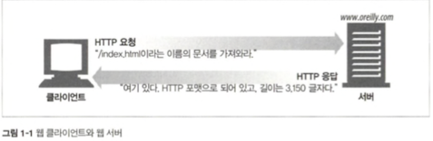
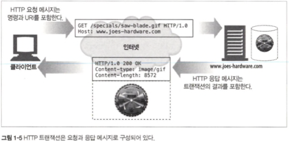
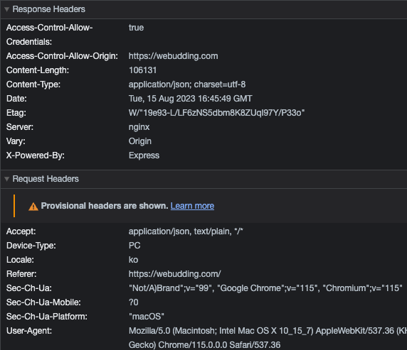

HTTP 완벽 가이드

# Chatpter1. HTTP 개관

전 세계 웹브라우저, 서버, 웹 애플리케이션이 대화하는 현대 인터넷의 공용어

## 1.1 HTTP: 인터넷의 멀티미디어 배달부

신뢰성 있는 데이터 전송 프로토콜인 **TCP**를 사용하기 때문에, 전송 중 손상이 가는 것을 걱정할 필요가 없다.

## 1.2 웹 클라이언트와 서버

### 웹 서버

> HTTP 프로토콜로 의사소통하기 때문에 보통 HTTP 서버라고 불림.

## 1.3 리소스

- 가장 단순한 웹 리소스는 웹 서버 파일 시스템의 정적파일이다.
- 요청에 따라 콘텐츠를 생상하는 프로그램이 될 수도 있음.

### 미디어 타입 ( MIME - Multipurpose Internet Mail Extensions )

> 수천 가지의 데이터 타입을 다루기 때문에, 확장자 등이 아닌 신중히 붙여진 MIME 타입이라는 데이터 포맷 라벨을 사용함.

사선(/)으로 구분된 주 타입, 부 타입으로 이루어진 문자열 라벨.

> [예시] MIME-Type

`text/plain`, `text/css`, `application/json`, `image/jpeg` 등

### URI

웹 서버 리소스는 통합 자원 식별자 (uniform resource identifier ) 라고 불림.

### URL ( 통합 자원 지시자 - uniform resource locator )

- 특정 서버의 한 리소스에 대한 구체적인 위치를 서술함.
- 오늘날의 대부분의 URI는 URL에 해당됨.

> `스킴` https:// `주소` webudding.com `리소스` /index.html

### URN ( uniform resource name )

콘텐츠를 이루는 한 리소스이 대해, 위치에 영향 받지 않는 유일무이한 이름 역할.

> 전 세계 웹 상에 채택하기 위해 여전히 실험 중인 상태이다.

## 1.4 트랙잭션

### 메서드

> 모든 HTTP 요청 메시지는 한 개의 메서드를 갖는다.

| 메소드 | 설명                                                               |
| ------ | ------------------------------------------------------------------ |
| GET    | 서버에서 클라이언트로 지정한 리소스 요청                           |
| PUT    | 클라이언트에서 서버로 보낸 데이터를 지정한 이름의 리소스 저장 요청 |
| DELETE | 지정한 리소스를 서버에서 삭제 요청                                 |
| POST   | 클라이언트 데이터를 서버 게이트웨이 애플리케이션으로 전송 요청     |
| HEAD   | 지정한 리소스에 대한 응답에서, HTTP 헤더 부분만 요청               |

### 상태 코드

> 클라이언트에게 요청이 성공했는지, 추가 조치가 필요한지 알려주는 세 자리 숫자.

| 상태 코드 | 설명                           |
| --------- | ------------------------------ |
| 200       | 올바른 요청 성공.              |
| 302       | 다른 곳에서 리소스 재전송 요망 |
| 404       | 리소스를 찾을 수 없음.         |

## 1.5 메시지

- 이진 형식이 아닌 일반 텍스트로 이루어진 줄 단위의 문자열.
- 클라이언트에서 서버로 보낸 요청 메시지
- 서버에서 클라이언트로 가는 응답 메시지

1. 첫 줄은 **시작줄**로, 요청은 무엇을 해야 하는지 응답이라면 무엇이 일어났는지
2. 헤더
   
3. 빈 줄 다음으로, 어떤 종류의 데이터든 들어갈 수 있는 **본문**이 나오게 된다.

## 1.6 TCP 커넥션

### TCP/IP

HTTP는 애플리케이션 계층 프로토콜이다.

> TCP

- 오류 없는 데이터 전송
- 순서에 맞는 전달 ( 항상 순서대로 도착 )
- 조각나지 않는 데이터 스트림 ( 어떤 크기든 가능 )

### IP 주소와 포트번호

> IP 주소와 포트번호를 사용해 클라이언트와 서버 사이에 TCP/IP 커넥션을 맺음.

`http://192.167.0.1:7738/index.html`

- IP 주소: `192.167.0.1`
- 포트번호: 7738

## 1.7 프로토콜 버전

- HTTP/0.9 ~ **HTTP/1.1** ( 오늘날 사용되고 있는 HTTP 버전)
- HTTP/2.0 : 1.1의 성능 문제를 개선하기 위해 구글의 SPDY 프로토콜을 기반으로 이루어진 프로토콜

## 1.8 웹의 구성요소

1. 프락시
   - 클라이언트와 서버사이에 위치한 HTTP 중개자
   - 주로 *보안*을 위해 사용됨.
2. 캐시
   - 많이 찾는 웹페이지의 *사본*을 클라이언트 가까이에 보관하는 HTTP 창고
3. 게이트웨이
   - 다른 애플리케이션과 연결되어 있는 특별한 웹 서버
   - 주로 HTTP 트래픽을 다른 프로토콜로 *변환*하기 위해 사용됨.
4. 터널
   - HTTP 통신을 전달하기만 하는 특별한 프락시
   - raw 데이터를 조회없이 그대로 전달해주는 HTTP 애플리케이션
5. 에이전트
   - 자동화된 HTTP 요청을 만드는 웹클라이언트
   - 사용자를 위해 HTTP 요청을 만들어주는 클라이언트 프로그램
   - 사용자 없이 트랜잭션을 일으키며 콘텐츠를 받아오는 봇과 같은 형태의 자동화된 에이전트도 있음.
