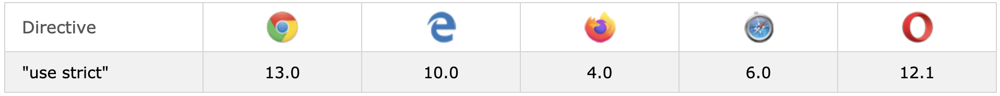

### ECMAScript(ES5)가 등장하면서,
기존 javascript의 몇 가지 기능이 변경이 되었다.
때문에 생기는 하위 호환성 문제를 방지하기 위해,
ES5의 기본 모드에서는 변경사항이 적용되지 않게 설계되었다.
이때, 엄격 모드(Strict mode)를 활성화하면, 변경사항이 적용된다.

# use strict
```js
// 스크립트 '최상단'에 아래와 같이 선언하면 엄격 모드가 활성화 된다.
'use strict'

function test01() {
  ... // active strict mode...
}

function test02() {
  ...// active strict mode...
}


// 특정 함수에 엄격 모드를 활성화 시키고 싶을 시, 아래와 같이 할 수 있다.
function test01() {
  'use strict'
  ... // active strict mode...
}

function test02() {
  ... // inActive strict mode...
}
```

- Strict mode는 전체 코드와 함수 블록 내에서 적용이 가능하다.
- {} 괄호 블럭에서는 적용되지 않는다.
- 컨텍스트 같은 범주에서는 적용되지 않는다.


# Strict Mode란?

- ES5에 나온 키워드로, 기존 보다 엄격한 오류 검사를 하는 방법.


- 장점
  1. 흔히 발생하는 오류를 예외로 발생 시킨다.
  2. 안전하지 않은 액션이 발생하는 것을 방지한다.
  3. 정확하게 고려되지 않은 기능들을 비활성화 시킨다.


- Strict mode로 달라지는 점

  1. 실수를 에러로 변환 ( Converting mistakes into errors )

        - 어느 정도의 실수(오류)를 무시하고 넘어가는 자바스크립트의 특징을 strict mode에서는 이 실수들을 에러로 변환하여 엄격하게 관리한다.

        - 선언하지 않고 전역 변수를 만들 수 없다.

          ```js
          'use strict'
          test = 1 // Uncaught ReferenceError: test is not defined
          ```

        - 읽기 전용 객체를 수정할 수 없다.

          ```js
          'use strict'
          var test = Object.defineProperties(
            {},
            {
              prop1: {
                value: 10,
                writable: false, // by default
              },
            }
          )

          test.prop1 = 2
          // TypeError: Cannot assign to read only property 'prop1' of object '#<Object>'
          ```

        - get으로 선언된 객체는 수정할 수 없다.

          ```js
          'use strict'
          var test = {
            get x() {
              return 2
            },
          }

          test.x = 1
          // TypeError: Cannot set property x of #<Object> which has only a getter
          ```

        - 확장 불가 객체에 새 프로퍼티를 할당할 수 없다.

          ```js
          'use strict'
          var test = { a: 1 }
          Object.preventExtensions(test)
          test.b = 'c'
          // TypeError: Cannot add property newProp, object is not extensible
          ```

        - 삭제할 수 없는 프로퍼티를 삭제할 때 예외를 발생시킨다. (시도가 어떤 효과도 없을 경우)

          ```js
          'use strict'
          delete Object.prototype
          // TypeError: Cannot delete property 'prototype' of function Object() { [native code] }
          ```

        - 객체에서 동일한 이름의 프로퍼티를 가질 수 없다. (ES6부터 가능해짐.)

          ```js
          'use strict'
          var test = { p: 1, p: 2 } // Syntax error
          ```

        - 함수에 동일한 인자 이름을 선언할 수 없다.

          ```js
          function test(p1, p1) {
            'use strict'
            return p1
          }

          test()
          // SyntaxError: Duplicate parameter name not allowed in this context
          ```

        - 8진수 숫자 리터럴, 이스케이프 문자를 사용할 수 없다.

          ```js
          'use strict'
          var test1 = 010
          // SyntaxError: Octal literals are not allowed in strict mode.
          // 숫자 10과 010은 10(2진수)과 010(8진수)으로 다른 값으로 인식된다.

          var test2 = \010
          // SyntaxError: Invalid or unexpected token
          ```

        - primitive 값에 프로퍼티를 설정하는 것이 불가능하다.

          ```js
          function test() {
            'use strict'

            false.true = '' // TypeError: Cannot create property 'true' on boolean 'false'
            ;(1).sailing = 'a' // TypeError: Cannot create property 'sailing' on number '1'
            'with'.you = 'far away' // TypeError: Cannot create property 'a' on string '1'
          }

          test()
          ```

  2. 변수 사용의 명료화(Simplify variable uses)

        - strict 모드는 코드상의 변수 이름을 특정 변수 정의로 매핑하는 방법을 단순화한다.

        - with문을 사용할 수 없다.

          ```js
          function test() {
            'use strict'

            // SyntaxError: Strict mode code may not include a with statement
            with ({ x: 1 }) {
              console.log(x)
            }
          }
          test()
          ```

        - 일반 함수 내에서 바깥의 this는 undefined이다.

          ```js
          function test() {
            'use strict'

            function test01() {
              console.log(this) // undefined
            }
            test01()

            function test02() {
              console.log(this) // test02 {}
            }
            new test02()
          }

          test()
          ```

---

strict mode 호환 브라우저 (출처 : https://www.w3schools.com/js/js_strict.asp)

